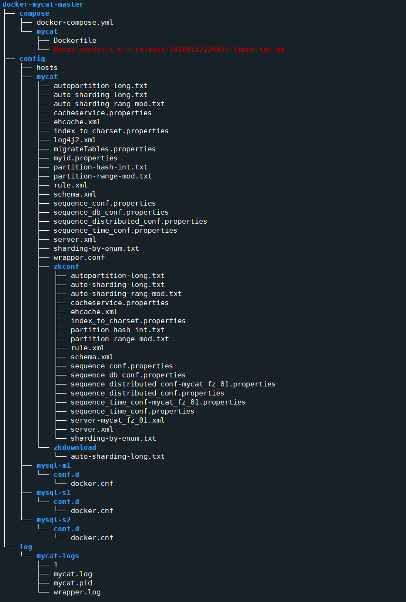
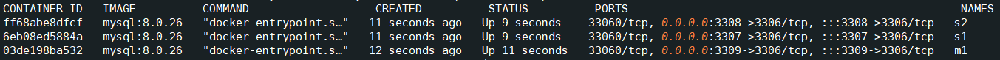
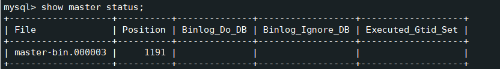
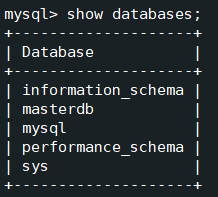

<a name="X3IGb"></a>
## 1.环境搭建(4台容器服务)
- m 节点:`172.25.0.2` `MySQL 8.0`
- s1 节点:`172.25.0.3` `MySQL 8.0`
- s2 节点:`172.25.0.4` `MySQL 8.0`
- Mycat 节点:`172.25.0.5` `MyCat 1.6`
<a name="r5y8z"></a>
### 1.1项目介绍

- 项目结构



- docker-compose.yaml 文件配置
```yaml
version: '3'
services:
  m1:
    image: mysql:8.0.26
    container_name: m1 #容器名字
    volumes:
      - ../config/mysql-m1/conf.d/docker.cnf:/etc/mysql/conf.d/docker.cnf:ro
      - ../config/hosts:/etc/hosts:ro
    ports:
      - "3309:3306"
    networks:
      mysql:
        ipv4_address: 172.25.0.2   # 添加ip用于连接
    # 进程限制为 65535
    ulimits:
      nproc: 65535
    hostname: m1
    mem_limit: 512m   # 内存大小
    restart: always  # 容器重启策略
    command: 
      - '--default-authentication-plugin=mysql_native_password'
      - '--character-set-server=utf8mb4'
    environment:
      MYSQL_ROOT_PASSWORD: m123456  # 密码
  
  s1:
    image: mysql:8.0.26
    container_name: s1
    volumes:
      - ../config/mysql-s1/conf.d/docker.cnf:/etc/mysql/conf.d/docker.cnf:ro
      - ../config/hosts:/etc/hosts:ro
    ports:
      - "3307:3306"
    networks:
      mysql:
        ipv4_address: 172.25.0.3
    links:
      - m1
    ulimits:
      nproc: 65535
    hostname: s1
    mem_limit: 512m
    restart: always
    command:
      - '--default-authentication-plugin=mysql_native_password'
      - '--character-set-server=utf8mb4'
    environment:
      MYSQL_ROOT_PASSWORD: s123456
  
  s2:
    image: mysql:8.0.26
    container_name: s2
    volumes:
      - ../config/mysql-s2/conf.d/docker.cnf:/etc/mysql/conf.d/docker.cnf:ro
      - ../config/hosts:/etc/hosts:ro
    ports:
      - "3308:3306"
    links:
      - m1
    networks:
      mysql:
        ipv4_address: 172.25.0.4
    ulimits:
      nproc: 65535
    hostname: s2
    mem_limit: 512m
    restart: always
    command: 
      - '--default-authentication-plugin=mysql_native_password'
      - '--character-set-server=utf8mb4'
    environment:
      MYSQL_ROOT_PASSWORD: s123456
  
  mycat:
    build: ./mycat
    container_name: mycat
    volumes:
      - ../config/mycat/:/mycat/conf/:ro
      - ../log/mycat-logs/:/mycat/logs/:rw
      - ../config/hosts:/etc/hosts:ro
    ports:
      - "8066:8066"
      - "9066:9066"
    # 连接容器
    links:
      - m1
      - s1
      - s2
    networks:
      mysql:
        ipv4_address: 172.25.0.5
    ulimits:
      nproc: 65535
    hostname: mycat
    mem_limit: 512m
    restart: always

networks:
  mysql:
    driver: bridge
    ipam:
      driver: default
      config:
      - subnet: 172.25.0.0/24
        gateway: 172.25.0.1

```

- Dockerfile 文件配置
```dockerfile
# 基于java:8-jre 镜像构建mycat
FROM java:8-jre
ENV mycat-version Mycat-server-1.6.5-release-20180122220033-linux.tar.gz
# 添加组名
USER root
COPY ./Mycat-server-1.6.5-release-20180122220033-linux.tar.gz /
RUN tar -zxf /Mycat-server-1.6.5-release-20180122220033-linux.tar.gz
# 设置容器环境变量
ENV MYCAT_HOME=/mycat
ENV PATH=$PATH:$MYCAT_HOME/bin
# 创建目录
WORKDIR $MYCAT_HOME/bin
RUN chmod u+x ./mycat
# 暴露端口
EXPOSE 8066 9066
# 启动mycat服务
CMD ["./mycat","console"]

```
mysql-m1 文件配置
```
[mysqld]
skip-host-cache
skip-name-resolve


character-set-client-handshake=FALSE
character-set-server=utf8mb4
collation-server=utf8mb4_unicode_ci
init-connect='SET NAMES utf8mb4'

# By default we only accept connections from localhost

max_connections = 1000

#bind-address   = 127.0.0.1
# Disabling symbolic-links is recommended to prevent assorted security risks

#给数据库服务的唯一标识，一般为大家设置服务器Ip的末尾号
server-id=2
log-bin=master-bin
log-bin-index=master-bin.index

```
mysql-s1 文件配置
```
[mysqld]
skip-host-cache
skip-name-resolve


max_connections = 1000

character-set-client-handshake=FALSE
character-set-server=utf8mb4
collation-server=utf8mb4_unicode_ci
init-connect='SET NAMES utf8mb4'
#log-error  = /var/log/mysql/error.log

# By default we only accept connections from localhost
#bind-address   = 127.0.0.1
# Disabling symbolic-links is recommended to prevent assorted security risks

server-id=3
log-bin=s1-bin.log
sync_binlog=1

```
mysql-s2 文件配置
```
[mysqld]
skip-host-cache
skip-name-resolve


character-set-client-handshake=FALSE
character-set-server=utf8mb4
collation-server=utf8mb4_unicode_ci
init-connect='SET NAMES utf8mb4'

max_connections = 1000

#log-error  = /var/log/mysql/error.log
# By default we only accept connections from localhost
#bind-address   = 127.0.0.1
# Disabling symbolic-links is recommended to prevent assorted security risks
server-id=4
log-bin=s2-bin.log
sync_binlog=1

```
mycat schema.xml  server.xml 文件配置

- schema.xml
```xml
<?xml version="1.0"?>
<!DOCTYPE mycat:schema SYSTEM "schema.dtd">
<mycat:schema xmlns:mycat="http://io.mycat/">

	<schema name="masterdb" checkSQLschema="false" sqlMaxLimit="100" dataNode="masterDN" />
	<dataNode name="masterDN" dataHost="masterDH" database="masterdb" />
	<dataHost name="masterDH" maxCon="1000" minCon="10" balance="1"
			  writeType="0" dbType="mysql" dbDriver="native" switchType="-1" slaveThreshold="100">
		<heartbeat>select user()</heartbeat>
		<writeHost host="m1" url="172.25.0.2:3306" user="root" password="m123456">
			<readHost host="s1" url="172.25.0.3:3306" user="root" password="s123456" />
			<readHost host="s2" url="172.25.0.4:3306" user="root" password="s123456" />
		</writeHost>
	</dataHost>

</mycat:schema>

```

- server.xml
```xml
<?xml version="1.0" encoding="UTF-8"?>
<!-- - - Licensed under the Apache License, Version 2.0 (the "License");
	- you may not use this file except in compliance with the License. - You
	may obtain a copy of the License at - - http://www.apache.org/licenses/LICENSE-2.0
	- - Unless required by applicable law or agreed to in writing, software -
	distributed under the License is distributed on an "AS IS" BASIS, - WITHOUT
	WARRANTIES OR CONDITIONS OF ANY KIND, either express or implied. - See the
	License for the specific language governing permissions and - limitations
	under the License. -->
<!DOCTYPE mycat:server SYSTEM "server.dtd">
<mycat:server xmlns:mycat="http://io.mycat/">
	<system>
	<property name="charset">utf8mb4</property>
	<property name="useSqlStat">0</property>  <!-- 1为开启实时统计、0为关闭 -->
	<property name="useGlobleTableCheck">0</property>  <!-- 1为开启全加班一致性检测、0为关闭 -->

		<property name="sequnceHandlerType">2</property>
      <!--  <property name="useCompression">1</property>--> <!--1为开启mysql压缩协议-->
        <!--  <property name="fakeMySQLVersion">5.6.20</property>--> <!--设置模拟的MySQL版本号-->
	<!-- <property name="processorBufferChunk">40960</property> -->
	<!--
	<property name="processors">1</property>
	<property name="processorExecutor">32</property>
	 -->
		<!--默认为type 0: DirectByteBufferPool | type 1 ByteBufferArena-->
		<property name="processorBufferPoolType">0</property>
		<!--默认是65535 64K 用于sql解析时最大文本长度 -->
		<!--<property name="maxStringLiteralLength">65535</property>-->
		<!--<property name="sequnceHandlerType">0</property>-->
		<!--<property name="backSocketNoDelay">1</property>-->
		<!--<property name="frontSocketNoDelay">1</property>-->
		<!--<property name="processorExecutor">16</property>-->
		<!--
			<property name="serverPort">8066</property> <property name="managerPort">9066</property>
			<property name="idleTimeout">300000</property> <property name="bindIp">0.0.0.0</property>
			<property name="frontWriteQueueSize">4096</property> <property name="processors">32</property> -->
		<!--分布式事务开关，0为不过滤分布式事务，1为过滤分布式事务（如果分布式事务内只涉及全局表，则不过滤），2为不过滤分布式事务,但是记录分布式事务日志-->
		<property name="handleDistributedTransactions">0</property>

			<!--
			off heap for merge/order/group/limit      1开启   0关闭
		-->
		<property name="useOffHeapForMerge">1</property>

		<!--
			单位为m
		-->
		<property name="memoryPageSize">1m</property>

		<!--
			单位为k
		-->
		<property name="spillsFileBufferSize">1k</property>

		<property name="useStreamOutput">0</property>

		<!--
			单位为m
		-->
		<property name="systemReserveMemorySize">384m</property>


		<!--是否采用zookeeper协调切换  -->
		<property name="useZKSwitch">true</property>


	</system>

	<!-- 全局SQL防火墙设置
	<firewall>
	   <whitehost>
	      <host host="172.18.0.2" user="root"/>
	      <host host="172.18.0.3" user="root"/>
				<host host="172.18.0.4" user="root"/>
	   </whitehost>
       <blacklist check="false">
       </blacklist>
	</firewall>-->

	<user name="root">
		<property name="password">123456</property>
		<property name="schemas">masterdb</property>

		<!-- 表级 DML 权限设置 -->
		<!--
		<privileges check="false">
			<schema name="TESTDB" dml="0110" >
				<table name="tb01" dml="0000"></table>
				<table name="tb02" dml="1111"></table>
			</schema>
		</privileges>
		 -->
	</user>

</mycat:server>

```
<a name="X9N33"></a>
## 2.服务部署

- 构建镜像
```shell
docker-compose build m1 s1 s2  #在compose 目录下
```

- 启动MySQL服务
```shell
docker-compose up -d m1 s1 s2
```


<a name="zeJaI"></a>
## 3.MySQL 8.0 主从配置

- 配置master主服务器，进入主容器
```shell
docker exec -it m1 /bin/bash
```

- MySQL
```sql
mysql -uroot -p

create user repl;

CREATE USER 'repl'@'172.25.0.%' IDENTIFIED BY 'repl';

GRANT REPLICATION SLAVE ON *.* TO 'repl'@'172.25.0.%';

FLUSH TABLES WITH READ LOCK;
```

- 查看binlog状态 记录File 和 Position 
```sql
show master status;
```


- 配置从库s1和s2,进入容器
```shell
docker exec -it s1 /bin/bash

docker exec -it s2 /bin/bash
```

- MySQL(s1,s2)
```sql
mysql -uroot -p

change master to master_host='m1',master_port=3306,master_user='repl',master_password='repl',master_log_file='master-bin.000003',master_log_pos=1191;

start slave;
```
<a name="iAB2f"></a>
## 4.MySQL8.0主从测试

- 连接master主服务器
```sql
docker exec -it m1 /bin/bash
```

- 测试
```sql
mysql -uroot -p

create database masterdb;

show databases;
```

- 连接s1,s2服务器查看是否有masterdb数据库
```sql
docker exec -it s1 /bin/bash

docker exec -it s2 /bin/bash

mysql -uroot -p

show databases;
```


<a name="fw9bp"></a>
## 5.启动MyCat服务

- 在compose 目录下
```sql
docker-compose up -d mycat
```

- 连接mycat或者用图形化界面连接
```sql
mysql -uroot -p -P8066 -hmycat
```

- 测试数据
```sql
CREATE TABLE test_table (
  id bigint(20) NOT NULL COMMENT 'ID',
  model_name varchar(200) DEFAULT NULL COMMENT '模块名',
  model_value varchar(200) DEFAULT NULL COMMENT '模块值',
  return_value varchar(200) DEFAULT NULL COMMENT '返回值',
  return_class varchar(200) DEFAULT NULL COMMENT '返回值类型',
  operate_user varchar(20) DEFAULT NULL COMMENT '操作用户',
  operate_time varchar(20) DEFAULT NULL COMMENT '操作时间',
  param_and_value varchar(500) DEFAULT NULL COMMENT '请求参数名及参数值',
  operate_class varchar(200) DEFAULT NULL COMMENT '操作类',
  operate_method varchar(200) DEFAULT NULL COMMENT '操作方法',
  cost_time bigint(20) DEFAULT NULL COMMENT '执行方法耗时, 单位 ms',
  source int(1) DEFAULT NULL COMMENT '来源 : 1 PC , 2 Android , 3 IOS',
  PRIMARY KEY (id)
) ENGINE=InnoDB DEFAULT CHARSET=utf8mb4;

```

- 插入数据
```sql
INSERT INTO test_table (id, model_name, model_value, return_value, return_class,operate_user, operate_time, param_and_value, operate_class,operate_method,cost_time，source) VALUES('1','user','insert','success','java.lang.String','10001','2022-01-06 18:12:28','{\"age\":\"20\",\"name\":\"Tom\",\"gender\":\"1\"}','cn.itcast.controller.UserController','insert','10',1);
INSERT INTO test_table (id, model_name, model_value, return_value, return_class, operate_user, operate_time, param_and_value, operate_class, operate_method,cost_time，source)VALUES('2','user','insert','success','java.lang.String','10001','2022-01-06 18:12:27','{\"age\":\"20\",\"name\":\"Tom\",\"gender\":\"1\"}','cn.itcast.controller.UserController','insert','23',1);
INSERT INTO test_table (id, model_name, model_value, return_value, return_class,operate_user, operate_time, param_and_value, operate_class, operate_method,cost_time，source)VALUES('3','user','update','success','java.lang.String','10001','2022-01-06 18:16:45','{\"age\":\"20\",\"name\":\"Tom\",\"gender\":\"1\"}','cn.itcast.controller.UserController','update','34',1);
INSERT INTO test_table (id, model_name, model_value, return_value, return_class, operate_user, operate_time, param_and_value, operate_class, operate_method, cost_time，source)VALUES('4','user','update','success','java.lang.String','10001','2022-01-06 18:16:45','{\"age\":\"20\",\"name\":\"Tom\",\"gender\":\"1\"}','cn.itcast.controller.UserController','update','13',2);
INSERT INTO test_table (id, model_name, model_value, return_value, return_class, operate_user, operate_time, param_and_value, operate_class, operate_method, cost_time，source) VALUES('5','user','insert','success','java.lang.String','10001','2022-01-06 18:30:31','{\"age\":\"200\",\"name\":\"TomCat\",\"gender\":\"0\"}','cn.itcast.controller.UserController','insert','29',3);
INSERT INTO test_table (id, model_name, model_value, return_value, return_class, operate_user, operate_time, param_and_value, operate_class, operate_method, cost_time，source)VALUES('6','user','find','success','java.lang.String','10001','2022-01-06 18:30:31','{\"age\":\"200\",\"name\":\"TomCat\",\"gender\":\"0\"}','cn.itcast.controller.UserController','find','29',2);

```
